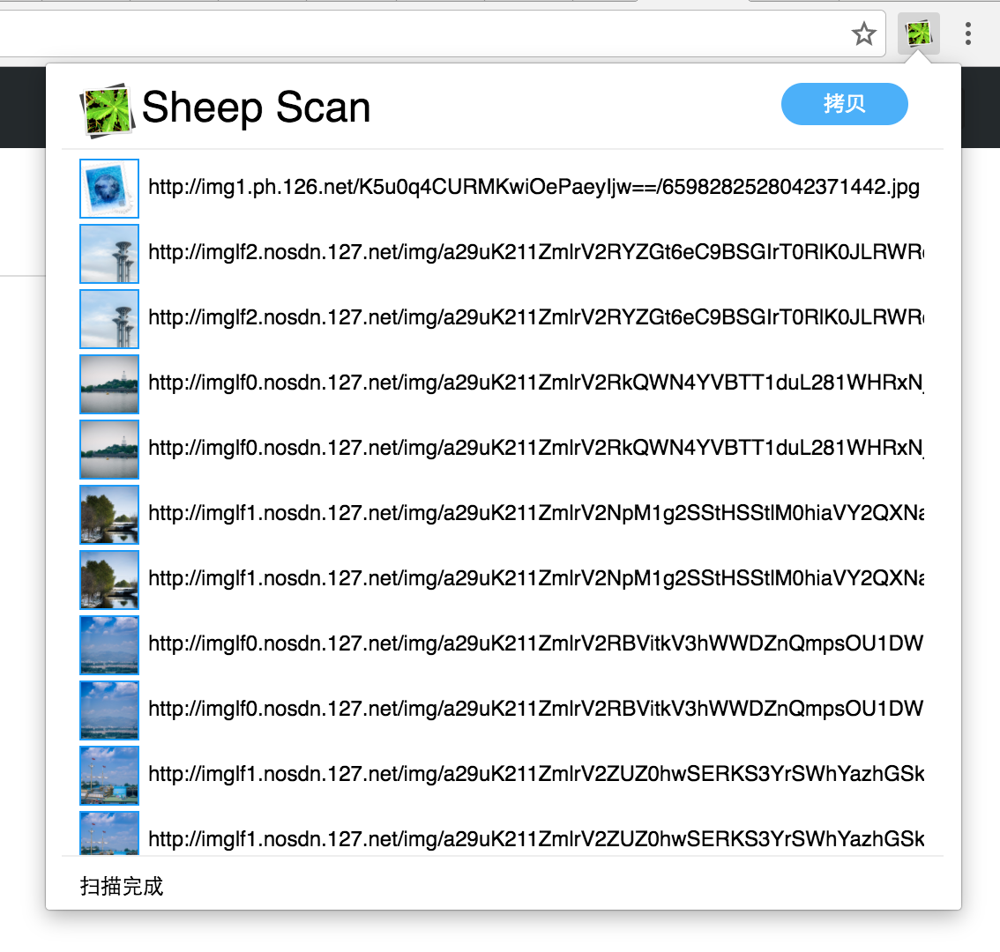

# Sheep Scan
获取页面图片地址的Chrome插件

## 图示

## 下载
    git clone  https://github.com/stanejia/sheep-scan

## 安装
* 使用chrome 访问 [chrome://extensions/](chrome://extensions/)
* 勾选"开发者模式"
* 点击"加载已解压的扩展程序"
* 选择 clone后的目录

## 使用
在需要获取图片的页面点击”图标"

## 关于下载
拷贝出的URL可由[chrono-download-manager](https://chrome.google.com/webstore/detail/chrono-download-manager/mciiogijehkdemklbdcbfkefimifhecn)插件进行下载.
